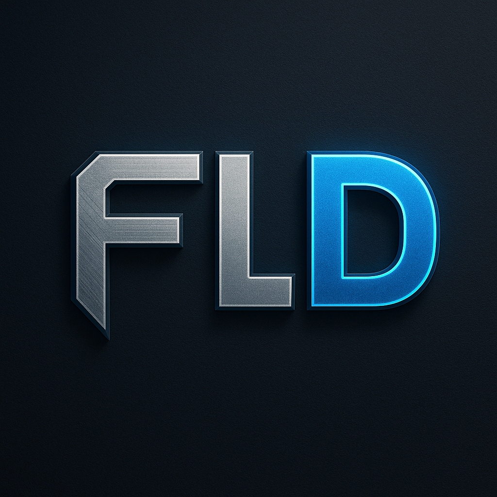

<div align="center">
  
  <h1>FLD Veiculos</h1>
</div>

<div align="center">
  <p>
    <strong>Uma plataforma moderna para compra e venda de veículos, desenvolvida como um projeto completo para demonstrar habilidades em desenvolvimento front-end.</strong>
  </p>
</div>

<div align="center">
  <!-- Badges -->
  
  
  
</div>

<br>

## 🚀 Sobre o Projeto
O **FLD Veiculos** é uma aplicação web front-end que simula uma plataforma de classificados de automóveis. O projeto foi criado para ser um case de portfólio, demonstrando a construção de uma interface rica, interativa e totalmente responsiva, utilizando tecnologias web fundamentais.

A aplicação oferece uma experiência de usuário fluida e moderna, desde o cadastro e login (simulados via `localStorage`) até a busca e filtragem de veículos em uma vitrine dinâmica, com design futurista e efeitos visuais avançados.

## ✨ Funcionalidades Principais
- **Vitrine de Veículos:** Carregamento dinâmico de carros a partir de um arquivo `JSON` com cards interativos.
- **Busca e Filtragem Avançada:** Sistema de filtros múltiplos para encontrar o carro ideal por cor, tipo, preço, ano e transmissão.
- **Autenticação de Usuário:** Simulação de cadastro e login para acesso a áreas restritas (vitrine).
- **Design 100% Responsivo:** Interface totalmente adaptável para todos os dispositivos (desktop, tablet, mobile).
- **Design Futurista:** Tema escuro com efeitos neon, glassmorphism e animações modernas.
- **Animações e Efeitos Visuais:** Transições suaves, efeitos hover e animações de scroll para uma experiência premium.
- **Contato Direto:** Links para redes sociais e botão de contato via WhatsApp para cada veículo.
- **Navegação Intuitiva:** Menu responsivo com efeitos visuais e navegação suave entre seções.

## 📱 Responsividade Completa
O projeto foi desenvolvido com foco total na responsividade, garantindo uma experiência perfeita em todos os dispositivos:

### **🖥️ Desktop (1024px+)**
- Layout completo com todas as funcionalidades
- Cards de serviços em grid de 4 colunas
- Navegação horizontal completa

### **📱 Tablets (768px - 1024px)**
- Layout adaptado com 2 colunas nos serviços
- Elementos redimensionados para melhor visualização
- Navegação otimizada para touch

### **📱 Mobile Grande (481px - 767px)**
- Layout em coluna única
- Cabeçalho reorganizado em formato vertical
- Cards de serviços empilhados
- Formulários adaptados para mobile

### **📱 Mobile Pequeno (320px - 480px)**
- Elementos otimizados para telas pequenas
- Fontes e espaçamentos ajustados
- Botões e inputs redimensionados

### **📱 Mobile Muito Pequeno (até 320px)**
- Ajustes específicos para dispositivos antigos
- Layout ultra-compacto mantendo funcionalidade

### **🔄 Orientação Paisagem**
- Ajustes específicos para mobile na horizontal
- Otimização de altura e espaçamentos

## 🛠️ Tecnologias Utilizadas
O projeto foi construído utilizando as seguintes tecnologias:

- **HTML5:** Para a estrutura semântica das páginas com comentários profissionais.
- **CSS3:** Para estilização, layout (Flexbox), animações e media queries responsivas.
- **JavaScript (ES6+):** Para manipulação do DOM, interatividade, `fetch API` e lógica de filtros.

## �� Características do Design
- **Tema Escuro Futurista:** Cores escuras com destaque em azul neon
- **Glassmorphism:** Efeito de vidro nos cards e elementos
- **Animações Suaves:** Transições e efeitos hover em todos os elementos
- **Tipografia Moderna:** Fontes personalizadas e hierarquia visual clara
- **Efeitos Neon:** Botões e elementos com brilho azul
- **Layout Flexível:** Uso de Flexbox para layouts responsivos

## ⚙️ Como Executar o Projeto

Como este é um projeto puramente front-end, não há necessidade de um processo de build complexo.

1.  **Clone o repositório:**
    ```bash
    git clone https://github.com/fernando7kyna/FLD-veiculos.git
    ```
2.  **Navegue até o diretório do projeto:**
    ```bash
    cd FLD-veiculos
    ```
3.  **Abra o arquivo `index.html` no seu navegador:**
    - Você pode simplesmente clicar duas vezes no arquivo `index.html` na sua pasta.
    - Ou, para uma melhor experiência (evitando problemas com CORS no `fetch`), use uma extensão como o **Live Server** no Visual Studio Code.

## 🌐 Acesso ao Projeto
Você pode visualizar o projeto em funcionamento através do link de demonstração abaixo:

- **Ver demonstração:** `https://fld-veiculos-sbns.vercel.app/` 
  *(Substitua este texto pelo link quando hospedar o projeto, por exemplo, no GitHub Pages ou Vercel)*

## 👨‍💻 Autor

<a href="https://www.linkedin.com/in/fernando-fullstackdev/">
 
 <br />
 <sub><b>Fernando Lima</b></sub>
</a>
<br />

[](https://www.linkedin.com/in/fernando-fullstackdev/)
[](https://github.com/fernando7kyna)

---

<p align="center">
  Feito com ❤️ por Fernando Lima
</p>
